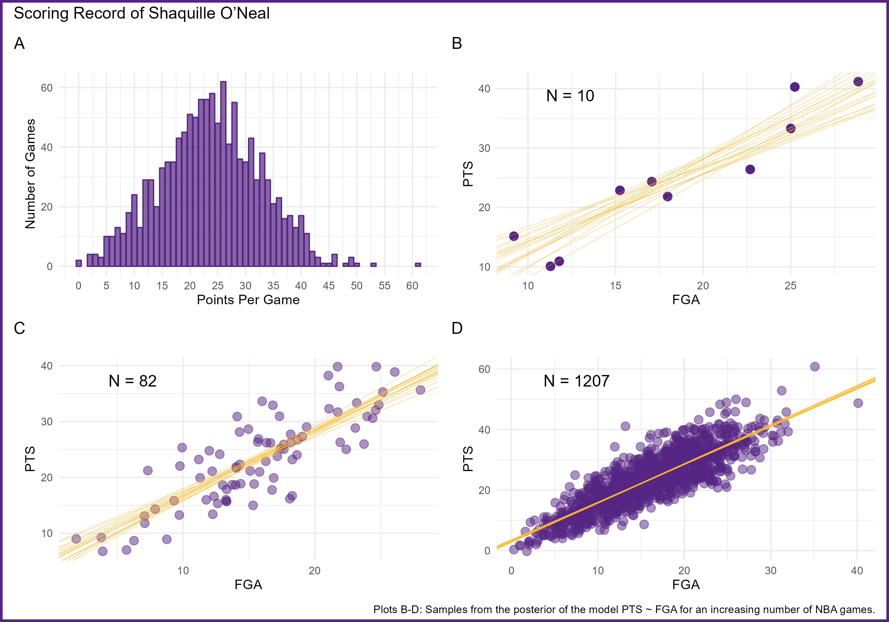

# Introduction to Bayesian Data Analysis

### **Welcome!**

This is the accompanying GitHub repository for the course “Introduction
to Bayesian Data Analysis” at the TUM School of Management.

## Schedule

*Check regularly for updates!*

More information can be found in the
[syllabus](https://github.com/linushof/BayesIntro/blob/main/syllabus/syllabus.md).

<table style="width:99%;">
<colgroup>
<col style="width: 6%" />
<col style="width: 30%" />
<col style="width: 61%" />
</colgroup>
<tbody>
<tr class="odd">
<td><h3 id="date">Date</h3></td>
<td><h3 id="topic">Topic</h3></td>
<td><h3 id="slides">Slides</h3></td>
</tr>
<tr class="even">
<td>19 April</td>
<td>Intro</td>
<td><a
href="https://www.moodle.tum.de/pluginfile.php/4521598/mod_resource/content/1/session_1_intro.pdf">Slides</a></td>
</tr>
<tr class="odd">
<td>26 April</td>
<td>Scientific data analysis as amateur software development</td>
<td><a
href="https://www.moodle.tum.de/pluginfile.php/4527976/mod_resource/content/1/session_2_software.pdf">Slides</a></td>
</tr>
<tr class="even">
<td>03 May</td>
<td>Cancelled</td>
<td></td>
</tr>
<tr class="odd">
<td>10 May</td>
<td>Scientific inference and Bayesian updating</td>
<td><a
href="https://www.moodle.tum.de/pluginfile.php/4546200/mod_resource/content/1/session_3_bayesian_updating.pdf">Slides</a></td>
</tr>
<tr class="even">
<td>17 May</td>
<td>Workflow for Bayesian parameter estimation</td>
<td><a
href="https://www.moodle.tum.de/pluginfile.php/4554319/mod_resource/content/1/session_4_workflow.pdf">Slides</a></td>
</tr>
<tr class="odd">
<td>24 May</td>
<td>Linear models Part 1</td>
<td><a
href="https://www.moodle.tum.de/pluginfile.php/4560435/mod_resource/content/1/session_5_linear_models_part_1.pdf">Slides</a></td>
</tr>
<tr class="even">
<td>31 May</td>
<td>Linear models Part 2</td>
<td><a
href="https://www.moodle.tum.de/pluginfile.php/4565128/mod_resource/content/1/session_6_linear_models_part_2.pdf">Slides</a></td>
</tr>
<tr class="odd">
<td>07 June</td>
<td>Markov Chain Monte Carlo Methods</td>
<td><a
href="https://www.moodle.tum.de/pluginfile.php/4573610/mod_resource/content/1/session_7_MCMC.pdf">Slides</a></td>
</tr>
<tr class="even">
<td>14 June</td>
<td>Multilevel models Part 1</td>
<td></td>
</tr>
<tr class="odd">
<td>21 June</td>
<td>Multilevel modeling Part 2</td>
<td></td>
</tr>
<tr class="even">
<td>28 June</td>
<td>No session</td>
<td></td>
</tr>
<tr class="odd">
<td>05 July</td>
<td>Generalized linear models</td>
<td></td>
</tr>
<tr class="even">
<td>12 July</td>
<td>Model comparison</td>
<td></td>
</tr>
<tr class="odd">
<td>19 July</td>
<td>Outro and Evaluation</td>
<td></td>
</tr>
</tbody>
</table>
