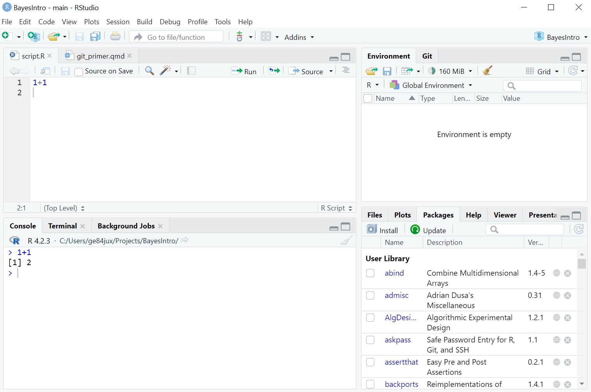
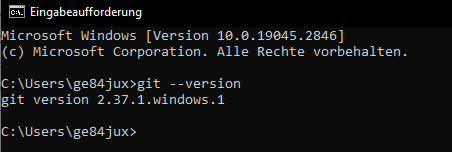
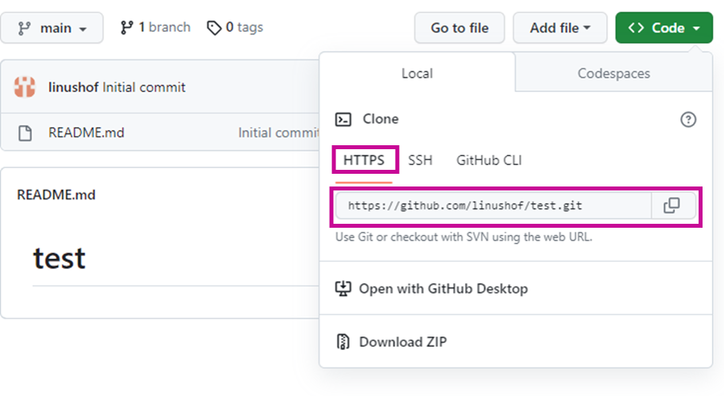
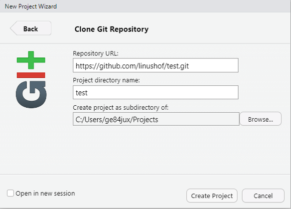
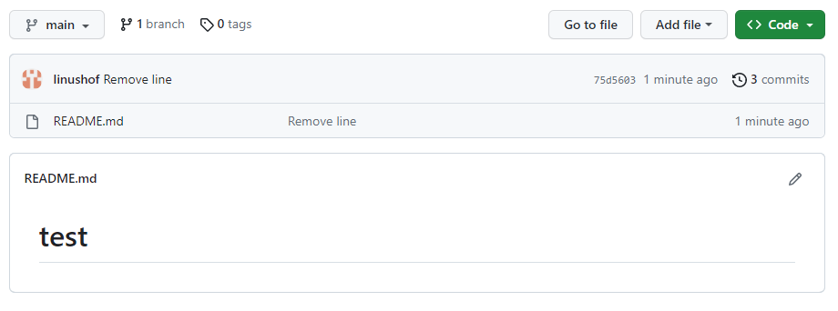
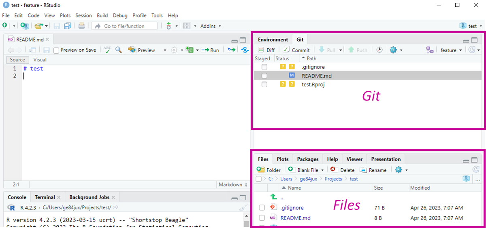
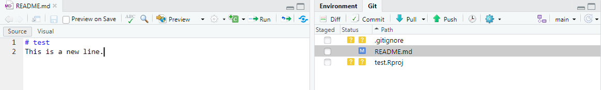
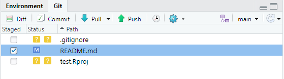
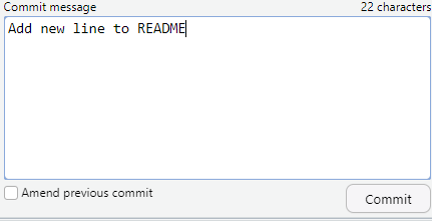
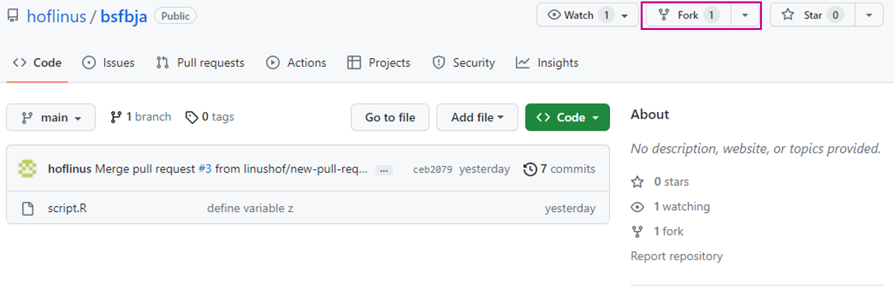

Git, GitHub & R
================

# Prerequisites

- [x] [R](https://cloud.r-project.org) installed
- [x] [RStudio](https://posit.co/products/open-source/rstudio/)
  installed
- [x] [Git](https://git-scm.com/downloads) installed
- [x] [GitHub](https://github.com) account created

# Hello `R`

## What is R code and how does it work?

`R` is an *interpreted high-level* programming language specifically
tailored to statistical computing. In fact, `R` can do more than
statistical computing, but that’s what it was designed for, that’s what
it’s good at, and that’s what we’re primarily concerned with in this
course.

*High level* refers to the fact that we as `R` users aren’t required to
know anything at all about the computers architecture and machine code.
This doesn’t mean that machine code isn’t important. Machine code is the
only language that your computer understands and executes. However,
machine code is hard to write and understand and not a desirable tool to
actively work with in data analysis projects. `R` code makes our lives
much easier: It is much more readable and straightforward to write
because it relies on elements of natural language and programming
concepts such as loops and functions, data structures like data frames,
and expressions including arithmetic and true/false statements, which
are either familiar and relatively easy to learn.

Because `R` code is not machine code and this is what is ultimately
required to get your machine and code running, `R` code needs to be
interpreted and translated to machine code. This is what a so-called
*interpreter* does and this is what makes `R` an *interpreted* language.
If you are just concerned with data analysis, it’s not necessary to
understand the technical aspects of this translation process. What you
need to learn and practice is how write some `R` code.

`R` code consists of written commands that are read and executed by a
command-line interpreter. To access the interpreter and write `R` code,
we take a brief look into the *R console*, `R`’s command-line interface.


In the console you can write code (e.g., `1+1`) and execute it by
pressing `Enter`. Below the code, `R` returns the *output* (i.e., `2`).
Every line of code needs to end up in the console in order to be
executed and to obtain its output.

## Giving R a better look with RStudio

The console has some shortcomings. For one, the console doesn’t secure
your code once you close it. Since data analysis projects can take days,
months or even years, this is a problem: You won’t and can’t start from
scratch every time. The simple solution is to write your code in a text
file that can be saved on your machine. Text files that only contain
code are referred to as *scripts* and usually have a file extension that
indicates the language in which the code is written. `R` scripts have
the extension ‘.R’.

Another shortcoming of the console is that it looks boring and doesn’t
allow for much more than just writing code. However, throughout this
course you’ll realize that a proper data analysis workflow requires much
more than just writing code. Thus, we’ll not directly work in console
but rely on *RStudio*. RStudio is an *integrated development
environment* (IDE) that provides a powerful and user-friendly interface
for working with `R`.



RStudio is designed to ease the use of `R` and improve your efficiency
by offering a range of tools and features that streamline data
management, coding, and analysis.

One feature of RStudio is that offers more than one *panel*. Each panel
provides access to different kinds of information. E.g., the upper left
panel in the above screenshot entails a script `script.R`, in which we
can write and secure the code we previously entered in the console. In
the panel below, you see the console again. Remember that the console
remains the processing engine and that every line of code must be passed
through it in order to be executed. However, you don’t have to
copy-and-paste your code from the script to the console every time.
Instead, you can directly execute code from the script in the console by
pressing the key combination `ctrl` + `enter` (Windows) or `cmd` +
`enter` (macOS). You can store this script like any other file on your
computer, ready to be executed at any time.

You’ll learn about the other panels and their functionality throughout
the course and on the fly. At this point, let’s just briefly consider
other advantages of working in RStudio instead of just in the console.

- Enhanced code editing: RStudio provides a range of code editing
  features such as syntax highlighting, code completion, and error
  checking that make it easier to write and debug R code.

- Integrated documentation: RStudio provides easy access to R’s
  documentation, making it easier to learn and use the language
  effectively.

- Workspace management: RStudio provides a range of tools for managing R
  workspaces, including the ability to view, load, and save data, and to
  manage R packages.

- Integrated debugging: RStudio provides powerful debugging tools that
  help to identify and resolve errors in R code, including the ability
  to step through code line-by-line and to set breakpoints.

- Integration with version control systems: RStudio integrates with
  popular version control systems such as Git, making it easier to
  manage and collaborate on R projects.

You’ll learn about these features and how to integrate them in your
workflow throughout this course. The important take-away is that
everything that can be done using only the console can be done in
RStudio too, but better. Thus, from now on, we will only access the
console via RStudio.

## Learning the R basics

Now that we’ve set up `R` and committed ourselves to using RStudio, we
want to learn the basics of programming in `R`. Many important commands,
functions, and concepts that we need throughout the course will be
introduced as we actually need them. At this point, we will focus only
on the most essential points to give you an idea of how R works and what
it feels like to create and manipulate some simple data structures.

### Arithmetic Expressions

*Arithmetic expressions* trigger mathematical operations on numerical
data. In `R`, these expressions follow the same order of operations as
in standard mathematics, even if some of the mathematical *operators*
may look a bit different from the ones on paper or in the calculator.

``` r
1+1 # addition
```

    [1] 2

``` r
1-1 # subtraction
```

    [1] 0

``` r
1*1 # multiplication
```

    [1] 1

``` r
1/1 # division
```

    [1] 1

``` r
# expressions where order of operations matter
1+1/2 #  division prior addition
```

    [1] 1.5

``` r
(1+1)/2 # brackets prior the rest
```

    [1] 1

### Objects

`R` is a *object-oriented* language because we use arithmetic
expressions and all kinds of other functions to create and manipulate
*objects*. Objects can be thought of as data storage, which we assign
names to. More specifically, objects usually entail data that is
structured in some way. Based on what exactly this data is and how it is
structured, we refer to the object as a certain type. Irrespective of
the *object type*, we can give objects whatever name we want. We now
look at different object types we will often encounter.

#### Scalars

Scalars are objects that represent individual values. They can take on
different data types, such as numerical, character, string, or logical:

- Numerical scalars represent numeric values, such as integers or
  decimal numbers.

- Character scalars represent individual characters, such as letters,
  digits, or punctuation marks.

- String scalars represent a sequence of characters, often in the form
  of a word or a phrase.

- Logical scalars represent logical values, such as TRUE or FALSE, which
  are commonly used for conditional expressions or comparisons.

We assign names to scalars — and all other objects by using the operator
`<-` (Windows: `Alt` + `-`; macOS: `Option` + `-`).

``` r
scal_num <- 1
scal_chr <- "a"
scal_str <- "word"
scal_log <- TRUE # logical/Boolean
```

We can access (look into) the object by typing its name and sending the
line to the console.

``` r
scal_num
```

    [1] 1

Having created scalar objects and knowing what they are, we can continue
operating on them. Let’s again run some arithmetic expressions.

``` r
scal_num + 1
```

    [1] 2

``` r
scal_num + scal_num
```

    [1] 2

``` r
scal_num + scal_num / 2
```

    [1] 1.5

``` r
(scal_num + scal_num) / 2
```

    [1] 1

The above examples gives us an idea of what `R` is doing when it is
supplied with an object that we previously created: It takes the data
that is stored inside them and runs the operation on the data. Storing
data in objects becomes particularly helpful if the data is not just a
scalar.

Before we turn to more complex object types, let’s briefly consider how
we can overwrite existing objects or create new objects by running
operations on existing ones.

``` r
scal_num <- scal_num + 1  # overwriting
scal_num
```

    [1] 2

``` r
scal_num2 <- scal_num + 1 # creating
scal_num2
```

    [1] 3

Occasionally, we will write code that represents an invalid operation.
In these cases, R will return an error message. E.g., we can multiply
numerical values, but not characters.

``` r
scal_chr * 4
```

<span style="color:red;">Error in scal_chr \* 4 : non-numeric argument
to binary operator</span>

If `R` returns an error, we have to inspect the code and find the error.
In most cases, simply re-running the command that triggered the error
message will not solve the problem.

#### Vectors

When working in `R`, vectors are among the most common data structures
we’ll encounter. A vector is an ordered collection of single values.
Although not mandatory, values of a vector often belong to the same data
type (e.g., numeric or character or logical). We can produce a vector
object using the now familiar `<-` assignment operator and the `c()`
command, which “chains” the values into a vector.

``` r
x <- c(1, 2, 3, 4) # create a vector object x
x
```

    [1] 1 2 3 4

One of `R`’s prime features is it’s *vectorized* nature. This means that
`R` performs the same operation on an entire vector — i.e., on each
value within a vector — at once.

``` r
x*2
```

    [1] 2 4 6 8

When manipulating vectors in `R`, the position of each value within the
vector is taken into account. Specifically, operations between vectors
are performed in a way that applies a given operation to elements that
occupy the same position in their vectors. To illustrate this, let us
take the example of multiplying two vectors `x` and `y` of the same
length (both contain 4 individual values). The multiplication operation
will be applied to the first value of x and the first value of y, the
second value of x and the second value of y, and so on. The resulting
output will be a vector of the same length as x and y.

``` r
x <- c(1, 2, 3, 4) # vector x
y <- c(1, 2, 3, 4) # vector y
x*y
```

    [1]  1  4  9 16

`R`s vectorized nature is a bit more tricky to deal with if vectors
don’t have the same length. Consider the following example where the `x`
from above is multiplied with a shorter vector `z`.

``` r
z <- c(1,2) # vector z
x*z
```

    [1] 1 4 3 8

What is going on here? When two vectors don’t have the same length, the
shorter vector is implicitly repeated until there are as many values as
in the longer vector. In the above case, `z` is implicitly translated
from `c(1,2)` into `c(1,2,1,2)`, i.e., it is replicated such that we
obtain 4 values. Then, as previously, the operations are performed
element wise. We can check this behavior by replicating the vector `z`
manually.

``` r
z <- rep(z, 2) # replicates and overwrite z
z
```

    [1] 1 2 1 2

``` r
x*z
```

    [1] 1 4 3 8

There is a lot more to learn and do with vectors. However, for now we
turn to a bit more complex data structure, one which entails multiple
vectors.

#### Data Frames

Being a collection of values, vectors are ideally suited to represent
variables in a data frame. Data frames are a data structures we’ll
encounter in virtually every data analysis project. [According to Hadley
Wickham](https://r4ds.had.co.nz/tidy-data.html), every messy data set is
messy in its own way, but tidy data sets are all alike. Specifically,
tidy data sets follow a small set of simple rules:

1.  Each variable must have its own column.
2.  Each observation must have its own row.
3.  Each value must have its own cell.

To put these rules in action, consider the following example, where we
first create 3 individual vectors, `x`, `y`, `z`, and then represent
them as different variables in a data frame object `dat`. For the latter
operation, we use the function `data.frame()`.

``` r
x <- c(1, 2, 3)
y <- c(4, 5, 6)
z <- c(7, 8, 9)
dat <- data.frame(x, y, z)
dat
```

      x y z
    1 1 4 7
    2 2 5 8
    3 3 6 9

Not all data sets in the wild will look this neat right from the start
and usually they will be a lot bigger. However, irrespective of its
initial form and size, in most data analysis projects you want to bring
the data into this format before you start analyzing it.

One advantage becomes immediately clear: Row numbers indicate positions
within the vectors that represent variables. This applies to all
variables (columns) in the data set without exception. To grasp the full
advantage, assume that each row represents a single unit of analysis
(e.g., countries, companies, individuals) — this is what rows usually
do. Now we can see that each value on each variable belongs to exactly
one unit, each indicated by the row number. To make this clear, let’s
add an indicator variable `ID` to `dat`.

``` r
ID <- c("A", "B", "C")
dat <- data.frame(ID, dat)
dat
```

      ID x y z
    1  A 1 4 7
    2  B 2 5 8
    3  C 3 6 9

Now we have three different analysis units, `A`, `B`, `C`, which could
stand for individual countries, companies, people or the like, each of
which has one value on each variable. In many — although not all — cases
we want to operate on variables across all analysis units (e.g.,
computing a variable mean, recoding variable values). In this case, we
can make perfect use of `R`’s vectorized nature and simply apply the
same operation on a variable to all rows at once. You’ll soon appreciate
both this particular data frame format and the vectorization feature.

As data frames are a very common data structure, we need to learn a set
of commands that help us to manipulate them and obtain the information
we want. We will now briefly go over some basic commands. Throughout the
course, we’ll also learn about a set of functions from the `tidyverse`
package that make writing code and working with data frames particularly
easy, even if the manipulations become rather complex.

As with vectors, we can apply the same operation to an entire data
frame. Consider the following example, where each cell entry is
multiplied by 2.

``` r
x <- c(1, 2, 3)
y <- c(4, 5, 6)
z <- c(7, 8, 9)
dat <- data.frame(x, y, z)
dat*2
```

      x  y  z
    1 2  8 14
    2 4 10 16
    3 6 12 18

To multiply each single value (cell entry), `R` operates element-wise
again, starting from the left and traversing the columns one by one from
top to bottom. This element-wise operation is implied by `R`’s
vectorized nature. Implicitly, `R` translates all cell entries in a
single vector and repeats the scalar 2 as often as there are cell
entries. Rarely, this is what we need and at times this behavior causes
confusion.

Instead, we usually want to apply operations to specific variables,
rows, or cells in a data frame. There are multiple ways to retrieve a
variable from a data frame. In the following, you can see at least 3
ways that come with the standard installation of `R`.

``` r
dat$x # dollar notation with variable name
```

    [1] 1 2 3

``` r
dat[, 1] # matrix notation with column number
```

    [1] 1 2 3

``` r
dat[, "x"] # matrix notation with variable name
```

    [1] 1 2 3

In the *matrix notation*, values prior the comma represent rows and
values after the comma represent columns. The matrix notation has two
advantages over the dollar notation: First, we can refer to columns both
by column number and variable name. Second, we can also obtain multiple
variables (columns) and rows at once or specific cell entries. This
makes subsetting data frames relatively straightforward.

``` r
# multiple columns
dat[, c(1,2)]
```

      x y
    1 1 4
    2 2 5
    3 3 6

``` r
dat[, c("x","y")]
```

      x y
    1 1 4
    2 2 5
    3 3 6

``` r
# specific cell entries
dat[1,1] # cell entry row 1 and column 1
```

    [1] 1

``` r
dat[1, "x"]
```

    [1] 1

Knowing how to retrieve variables from a data frame, we can now apply
operations on them. The basic principles of vectorized operations remain
the same. Consider the following 3 examples, where we multiply the
variable `x` from `dat` (column 1) with the vector `a`.

``` r
a <- c(1,2,3)
dat[, 1] * a 
```

    [1] 1 4 9

``` r
dat$x * a
```

    [1] 1 4 9

Importantly, the above code doesn’t change the object `dat` but only
returns the output of the operation. To store the outputs in `dat`, we
use the assignment operator `<-` again and point it to the position in
`dat` where we want to store the outputs. For instance, we can create a
new column `v` and attach it to the existing data frame.

``` r
dat[, "v"] <- dat[, "x"] * a 
dat
```

      x y z v
    1 1 4 7 1
    2 2 5 8 4
    3 3 6 9 9

Or we can overwrite an existing column:

``` r
# overriding
dat[, "v"] <- dat[, "v"] / a
dat
```

      x y z v
    1 1 4 7 1
    2 2 5 8 2
    3 3 6 9 3

#### Functions

Simple arithmetic operations are by no means the only possible
operations in `R`. You already come across other operations in the form
of *functions* such as `c()` `data.frame()` or `rep()`. Moreover,
multiple operations can be combined and chained to achieve more complex
computations. However, irrespective of the exact operation, the more
often you need it, the less inclined you should be to write the code
from scratch over and over and over again. Copying and pasting the code
can circumvent this problem, but it comes with its very own pitfalls. As
a general rule of thumb for programming — statistical or otherwise — you
want to reduce code duplications.

One way to reduce duplications in your `R` code is by working with
functions. Functions reduce code duplications by encapsulating a
particular set of commands that perform a computation and only
extracting the parts out that are changing between runs. To illustrate,
consider you want to run the same set of operations on multiple
variables. Although the only thing that changes between repeated runs is
the variable, you always need to send the entire code to the console,
which can easily make up several lines. Encapsulating a code in a
function allows you to reduce many lines to just a function name and
some arguments (the independent, changing parts) which together usually
make up no more than a line. This results in code and scripts that are
much cleaner, easier to read, and ultimately less prone to errors.

In the following, we briefly consider how functions are build. A
function generally consists of three parts:

1.  A function name.
2.  Objects and other arguments that are the inputs to the function
    (independent, changing parts).
3.  The code body `{}` that specifies the code and turns inputs into
    outputs.

To illustrate, consider the following code with which we define a
function `summing()` that sums up all values of a vector:

``` r
summing <- # function name
  function(x){ # inputs 
    
    # body 
    total <- 0
    for (i in 1:length(x)) {
    total <- total + x[i]
  }
  return(total)
    
}
```

At this point, we don’t need to understand all particularities of the
code. The main idea is that we have now created a function `summing()`
that sums up all values within numeric vectors. Specifically, the
function `summing()` takes as input a vector, substitutes the
placeholder `x` in the above code with this vector, and then executes
the code. To see the function in action, we just need to write the name
of the function and place the vector of interest in the input bracket.

``` r
x <- c(1,2,3)
summing(x)
```

    [1] 6

Of course, computing the sum of a vector is a common operation and there
is already a function in place for that:

``` r
sum(x)
```

    [1] 6

In general, because many sets of operations are fairly common and useful
to different projects, others might have already written a function for
this operation. Some of these functions might come with the initial `R`
installation such as `data.frame()`, `rep()`, and `sum()`, while others
are obtained by installing additional *packages* that are distributed
and freely available online. Either way, the important take-away is that
before you start repeatedly writing endless lines of code or racking
your brain to come up with a function, you should search online to see
if there is already a function that does what you need.

One last thing about `R` code and functions: You can combine the
operations of multiple functions by placing functions into one another.
The way it works is by reading the `R` code from the inside to the
outside. More specifically, a function returns an output. The output of
the inner (or enclosed) function can then be used as input for the outer
function. To illustrate consider the following example that combines the
`sum()` function and the `abs()` function, which returns the
non-negative absolute value of scalars. First, we run the operations one
by one by saving the output of `sum()` in a new object, which is then
used as input for `abs()`. Thereafter, we do it at once.

``` r
x <- c(-1, -2, -3)
sum_x <- sum(x)
sum_x
```

    [1] -6

``` r
abs(sum_x)
```

    [1] 6

``` r
abs(sum(x))
```

    [1] 6

#### Packages

To conclude this primer on `R`, let’s briefly elaborate a bit more on
the idea of *packages*. `R` packages may entail functions, data, and
documentation that are not provided with the standard installation of
`R`. `R` packages are created and maintained by a community of
developers and users who share their work with others. These packages
can be downloaded from the internet and installed in `R` using the
function `install.packages()` function. Once installed, the functions
and data in the package can be made available in `R` by using the
function `library()`. (You only have to install packages once and not
every time you use `R`. However, update them from time to time.)

In the following, we install the `tidyverse` package, which itself
contains a collection of packages that offer a rich and powerful set of
functions for working with data frames and analysing data.

``` r
install.packages("tidyverse")
library("tidyverse")
```

Besides the `tidyverse`, there are thousands of other `R` packages
available for a wide range of tasks, from data manipulation and
visualization to statistical modeling and machine learning. Using
packages will save you a lot of time and effort, allowing you to focus
on what you are here for: data analysis. Now that we have learned some
basics of `R`, we will continue with learning Git and GitHub.

# Why do we use Git and GitHub in this course?

(…)

In the following, we go through take the necessary steps to get `Git`
running on your machine and to allow your machine to communicate with
GitHub. These steps are mainly based on the excellent work of [Jenny
Bryan](https://creativecommons.org/licenses/by-nc/4.0/). For a much more
comprehensive introduction to `Git` and `GitHub`, visit her guide:
[Happy Git and GitHub for the
useR](https://happygitwithr.com/index.html)

# Hello `Git`

1.  Check if `Git` is already installed on your machine: Search on your
    system for a *Shell* or *Terminal*, open it and type
    `git --version`:



2.  If the command returns something along the lines `git version ...`,
    you’re good to continue. If the command returns something along the
    lines `git: command not found`, `Git` is not installed yet. In this
    case, install `Git` from the
    [browser](https://git-scm.com/downloads) and repeat the procedure.

3.  Introduce yourself to `Git`: Go to the *Shell/Terminal* or `Git`’s
    own command line interface *Git Bash* and provide `Git` your user
    name and your e-mail with the following commands. (Take care that
    the user name and address match those you use on GitHub.)

``` bash
git config --global user.name 'YOUR USERNAME'
git config --global user.email 'YOUR EMAIL ADDRESS'
```

4.  Check if everything works: Enter the command below and check if the
    output entails a line with your username and a line with your e-mail
    address.

``` bash
git config --global --list
```

- Done. Restart your machine.

# Hello GitHub

1.  If not done yet, go to [GitHub](https://github.com) and create an
    account with the e-mail address you introduced to `Git` before.

2.  To allow `Git` to communicate with GitHub via the security protocol
    HTTPS, we need to generate and store a [personal access token
    (PAT)](https://github.com/settings/tokens).

3.  Use the following `R` shortcut which opens your browser and comes
    with some useful pre-selected PAT settings.

``` r
install.packages("usethis")
usethis::create_github_token()
```

4.  In the browser that was opened, give the PAT a clear name (e.g.,
    my-private-machine), using the *Note* field.


- At the bottom of the page, click *Generate token*. A new window with a
  newly generated PAT will occur. Don’t close the window!

5.  Return to `R` and run the following lines of code:

``` r
install.packages("gitcreds")
gitcreds::gitcreds_set()
```

6.  If you don’t have a PAT stored already, there will be a message in
    the console that prompts you to enter your PAT. Go to the browser,
    copy the PAT to your clipboard, and paste it to the console.

7.  Done.

# Creating and cloning repositories

1.  Go to GitHub and create a [new repository](https://github.com/new)
    (repo).

2.  Give the repo a clear name:


3.  Click *Public*.

4.  Click *Add README file*.

5.  Click *Create repository*.

6.  Clone the *remote* repo to your computer via the green “\<\> Code”
    button. Click *HTTPS* and copy the URL address to your clipboard.



7.  Go to *RStudio* and create a new project: *File* \> *New Project …*
    \> *Version Control* \> *Git*.

8.  Copy the repository URL in the respective field of the pop-up
    window. In the bottom field, indicate where on your machine you want
    to store the project. Use a folder that is not synchronized with a
    Cloud or Drive or the like.



9.  Click “Create project”.

- *RStudio* will open a new project that is both, a folder on your
  machine and a *local* `Git` repository.

- Done.

# Part I: Collaborating with oneself

In the following, we’ll go through some fundamental steps in working
with `Git` and *Github*. These steps allow you to track any change of a
file in a repo, create a history\* of such changes, and sync local files
in the repo on your machine with the remote repo on Github. In
particular, we learn how to *commit* changes and how to *push* and *pull
them*:

- *committing*: commits are changes of a file in a *local* repo on your
  machine or the remote repo on GitHub.

- *pushing*: sending changes made in your local repo to the remote repo
  on GitHub

- *pulling*: retrieving any changes made in the remote repo on GitHub
  and merging them into your local repo.

In the following, we go through the necessary steps to make commits
locally and push them to *GitHub* via RStudio as well as the steps to
make commits remotely on `Github` and pull them to your machine.

## Committing and pushing from RStudio

1.  Take a look at your *GitHub* repo.



2.  Take a look in *RStudio* and visit the *File* and *Git* pane.



3.  In *RStudio*, ppen the `README.md` file, write a new line, save it,
    look at the changes in the Git pane.



4.  Commit the change by *staging* the file and clicking the *Commit*
    button.



5.  Review the changes and write a short but meaningful *commit
    message*.



6.  Click *Commit* and hang on.

7.  After one or several commits — you’ll likely commit more often than
    you push — click the green *Push* arrow (button) in the *Git* pane.

8.  Visit *GitHub* and check, whether the changes are synced. (You
    should see the new line in the `README.md` file.)

9.  Done.

## Commiting and pulling from GitHub

1.  Open the `README.md` file on *Github*.

2.  Write a new line and commit changes with the commit message.

3.  Go to *RStudio*, press the blue *Pull* arrow (button) Check the
    `README.md` in *RStudio*. and see whether the changes are synced.

4.  Done

The preceding steps for committing, pushing, and pulling can be applied
to any other file (e.g., `script.R`). However, there are some files that
you should neither track with *Git* nor sync them with *GitHub*. That
is, *Git* should [ignore](https://git-scm.com/docs/gitignore) them.

# Part II: Collaborating in teams

(…)

## Branching

- With `Git`, you can create feature branches besides the main branch.
  Such feature branches allow you to let the main branch as it is and
  test new things on them. Later, you can merge changes on the feature
  branch into the main branch.

To create and merge branches, take the following steps:

1.  Go to the *Terminal* pane in *RStudio* and execute the command
    below.

``` bash
git branch branch-name
```

2.  Switch (checkout) to the new feature branch.

``` bash
git checkout branch-name
```

3.  Make some changes to files in the repository and commit them.

4.  Switch back from the feature branch to the main branch and merge the
    commits.

``` bash
git checkout main
git merge branch-name
```

5.  Done.

## Creating pull requests

Branching is a necessary step to create *pull requests*, a fundamental
tool for collaborating via *GitHub*. Pull requests are requests to merge
a feature branch from a copy *fork* of an original *GitHub* repo into a
branch of the original repo. This allows you to contribute to someone
else’s work and, more generally, work as a team on the same project
while retaining a history of the project and the contributions.

To create a pull request, proceed as follows:

1.  Go to the original *GitHub* repo (source repo) you want to commit
    changes to and create a fork to your own *GitHub* account.



2.  Clone the fork to your local machine by creating a new R project
    with version control.

- Using the command line, check the remote repositories of your project.
  At this point, `origin` should be the only remote repository and it
  should be your fork.

``` bash
git remote -v
```

Before you start suggesting changes to the original repo, you want to
make sure to commit to the most recent version of the original repo.
That is, you want to be able to pull directly from the original repo.

3.  Therefore, add this repo as additional remote repo using the command
    below. As a convention the source repository is called `upstream`.

``` bash
git remote add upstream url-original-repository
```

4.  Check the remote repositories again. Now you also want to see the
    original repository.

`git remote -v`

One important thing to notice is that you are not allowed to push to the
original repo directly from your local fork. The only thing you can do
is *requesting* to commit changes. Therefore, you proceed as follows:

5.  In your local fork, create a feature branch.
6.  Make changes on that branch and commit them.
7.  Push the changes to a new remote branch in your fork.
8.  Chekout from the branch.

``` bash
git push origin branch-name
git checkout branch-name
```

4.  Visit your fork on *GitHub*. On the starting page, you will find a
    prompt to make a pull request to the original repo. Click on the
    prompt, comment, and create the request. The owner of the original
    repo will be notified and can review the request on *GitHub*.

Done.

### After the pull request

If the owner accepts your pull request, they will be committed to the
original repo and you will appear as contributor. In this case, you can
either delete the fork entirely or leave it to come back at a later
point. When you come back at a later point, you probably want to pick up
with the most recent version of the original repo. To obtain the most
recent changes and get your fork in sync, you have 2 options.

1)  Sync the remote fork in *GitHub* with the original repo, then pull
    from remote fork into the local fork.

2)  Pull from the original repo into your local fork by
    `git pull upstream main`, then push to the remote fork.

You are now set to make another pull request. For the new pull request,
you should create a new branch and not take the old one. Old branches
can be deleted using the command line:

``` bash
git branch -d branch-name #local
git push origin -d branch-name #remote
```

### Issues

On GitHub, you can also create issues to track bugs, request features,
point to other problems or list remaining to dos. To open an issue, go
to the issues page in a *GitHub* repo and click *New Issue*. Give the
issue a meaningful name and, optionally, add a comment for more context.

There are multiple ways to close an issue once it is resolved:

1)  You can close the issue on *GitHub* via the issue page.

2)  In your local repo, make a commit and close the issue with a commit
    message. The commit message must entail the following string
    `KEYWORD ISSUE`. The particular issue is indicated by a `#` and a
    number which you find on *GitHub*. Keywords that work for this
    procedure are: `close`, `closes`, `closed`, `fix`, `fixes`, `fixed`,
    `resolve`, `resolves`, `resolved`. E.g., to close an Issue \#5, you
    can write the commit message below. If you push the commit to
    GitHub, the issue will automatically be closed.

``` bash
some message; closes #5
```
